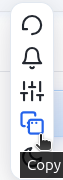
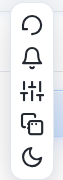

# BrowseMate

A privacy-focused AI companion for browsing: chat on any page with **OpenAI**, **Google Gemini**, or **Hugging Face** through a floating panel. **Version 2** adds voice input, reminders, clearer errors, and tighter BrowseMate branding.

## Features

- **Floating chat** — Draggable, resizable panel on any site (hidden until you add at least one API key).
- **Multiple providers** — OpenAI (GPT-4o family, o1, etc.), Gemini (Flash / Pro), Hugging Face Inference Router (several open models; vision when your token supports Inference Providers).
- **Vision & screenshots** — Send a viewport capture to vision-capable models where the provider allows it.
- **Voice input** — Optional mic dictation and speech language preference (browser-dependent).
- **Reminders** — Schedule reminders from the chat UI; delivered via notifications (and in-page when possible).
- **Quick actions** — Context-menu actions on selected text (explain, summarize, translate, and more).
- **Chat history** — Persisted locally per session.
- **Dark mode** — Matches system/extension preference from the toolbar popup.
- **Keyboard shortcut** — Toggle the floating UI (`Ctrl+Shift+Y` / `Command+Shift+Y` by default; override under `chrome://extensions/shortcuts`).
- **Privacy** — API keys and conversations stay on your device; requests go directly to the AI providers you configure.

## Quick start

1. Install the extension from the Chrome Web Store (or load unpacked for development).
2. Click the **BrowseMate** toolbar icon → **API Keys**, then add at least one key (OpenAI `sk-…`, Gemini from Google AI Studio, Hugging Face `hf_…` with Inference Providers if using HF router).
3. On pages where you’re logged in normally, the floating bubble appears — open it and start chatting.
4. Switch provider/model from the chat header as needed.

On **first install or update**, if no keys are saved yet, the extension opens the toolbar UI **once** so you are not left with no visible bubble and no hint where to configure keys.

## Privacy & security

- No BrowseMate backend — your keys talk straight to OpenAI, Google, or Hugging Face.
- Keys and history use **local extension storage** only (no sync vault from BrowseMate).
- See the privacy policy linked from the store listing / extension homepage.

## Requirements

- Chromium-based browser **88+** (Chrome, Edge, Brave, Vivaldi, etc.).
- At least one provider API key you manage yourself.
- Internet connectivity for AI requests.

## Documentation & links

- **Help / homepage**: linked via `homepage_url` in `manifest.json` (GitHub Pages).
- **Privacy policy**: same site — see manifest or store listing.

> **Note:** GitHub Pages URLs may still contain the legacy folder name `Extention_EasyAI_Chat`. The product name is **BrowseMate**. Adding redirects on Pages to paths containing `BrowseMate` is recommended for store reviewers and users.

## What’s new in V2

See **`CHANGELOG.md`** for detail. Summary:

- Hugging Face router + vision path for compatible tokens  
- Voice input and speech language option  
- Reminders  
- BrowseMate blue/teal branding and improved error text (network, quota, invalid key)  
- One-time onboarding tab when no keys exist  

For **store copy and release posts**, use **`STORE_LISTING.md`**.

## Tips

1. Drag the bubble to a comfortable corner; resize the panel from the corner handle where available.
2. Use the context menu on selected text for quick prompts without typing the selection.
3. If a request fails, read the in-chat error — it usually points to **toolbar → BrowseMate → API Keys** or waiting out a rate limit.
4. Hugging Face: create a fine-grained token with **Inference Providers** enabled for router models.

## Development

```bash
npm run package
```

Produces **`browsemate-v2.0.0.zip`** including manifest, scripts, styles, popup, settings, utils, `CHANGELOG.md`, and `STORE_LISTING.md`.

## Support

- **Contact**: support@browsemate.com  
- **License**: MIT — see `LICENSE`.

Ready to supercharge browsing with AI — install **BrowseMate**.
